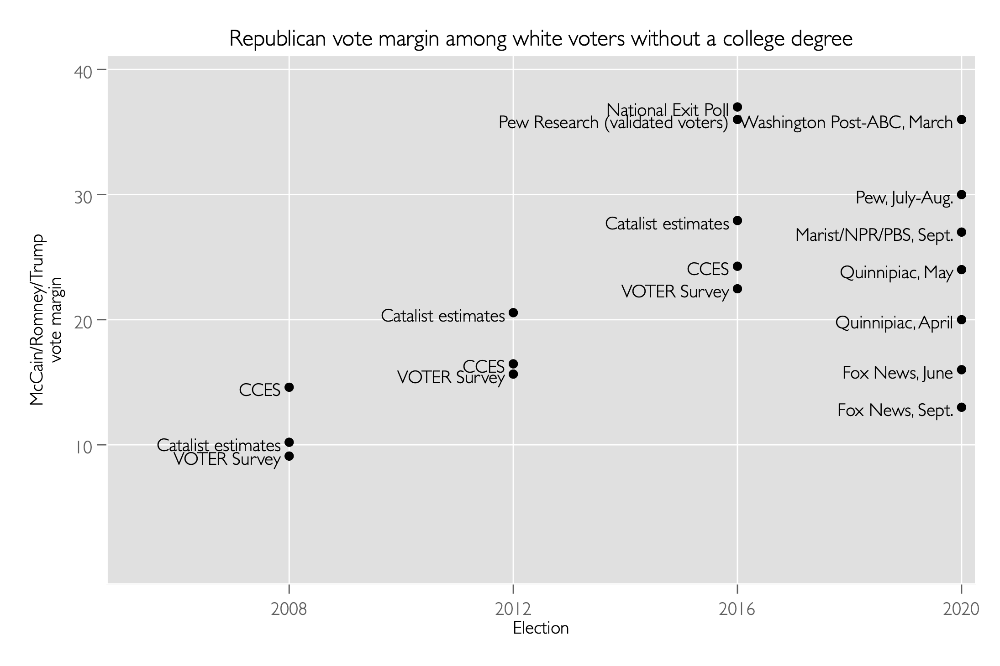

## Vote choice among white voters without a college degree (2008-16) and ranges for 2020

`twoway (scatter margin year, mlab(survey) mlabpos(9)), ///
yscale(r(0 40)) ///
xlabel(2008 2012 2016 2020) ///
xscale(r(2005 2012)) ///
xtitle("Election") ///
ytitle("McCain/Romney/Trump" "vote margin") ///
title("Republican vote margin among white voters without a college degree")`

